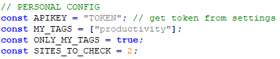
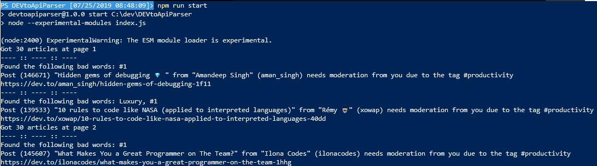

# DEV.to api parser

Supporting the moderation of articles

## enhancements

Planned enhancements to this project:

- Database to save already checked posts
- Definition of severity for bad words
- Global source for bad words
- More detailed outputs
- Check if articles have changed after initial check (saving content to db)
- GUI (maybe later)

## Setup and usage

Install dependencies with `npm install`.
Modify `index.js` and set up your [DEV.to API Access Token](https://dev.to/settings/account).
Also set your tags in the `MY_TAGS` array, if you want only posts with your tags to be checked (`ONLY_MY_TAGS`) and how many pages (30 articles per page) to check (`SITES_TO_CHECK`).
Then run it with `npm run start`.





## Note about the warnings

Not all articles flagged as "need your attention" may be bad / contain unwanted content. For exmaple the phrase `#1` is quite common in good posts but also in bad posts. In the future there will be a severity for each phrase to prevent good posts with those phrases to pop up.

## Install problems and solutions

### Error EINTEGRITY on npm install

The following or similar log could pop up when running `npm i`:

```
npm WARN tarball tarball data for sqlite3@https://github.com/mapbox/node-sqlite3/tarball/master (sha512-/YGQWMMiqHzl2+E8f6jcuaheEXXvwC3tSyBlH3ljvG+hD+7T04TXbGD6otrQfZ1igGeUU2rs6dGM1UPBTC33Wg==) seems to be corrupted. Trying one more time.
npm WARN tarball tarball data for sqlite3@https://github.com/mapbox/node-sqlite3/tarball/master (sha512-/YGQWMMiqHzl2+E8f6jcuaheEXXvwC3tSyBlH3ljvG+hD+7T04TXbGD6otrQfZ1igGeUU2rs6dGM1UPBTC33Wg==) seems to be corrupted. Trying one more time.
npm ERR! code EINTEGRITY
npm ERR! Verification failed while extracting sqlite3@https://github.com/mapbox/node-sqlite3/tarball/master:
npm ERR! Verification failed while extracting sqlite3@https://github.com/mapbox/node-sqlite3/tarball/master:
npm ERR! sha512-/YGQWMMiqHzl2+E8f6jcuaheEXXvwC3tSyBlH3ljvG+hD+7T04TXbGD6otrQfZ1igGeUU2rs6dGM1UPBTC33Wg== integrity checksum failed when using sha512: wanted sha512-/YGQWMMiqHzl2+E8f6jcuaheEXXvwC3tSyBlH3ljvG+hD+7T04TXbGD6otrQfZ1igGeUU2rs6dGM1UPBTC3
```

**Solution:**

```
rm package-lock.json
npm cache verify
```

## Changelog

###### 07/2019

- V1.0.0

  Add SQLite3 support for checked articles (node-sqlite3)

- V1.0.1

  Added Database for already processed articles

  Changed minimal character count to spot short posts (potential to be promotional or of no value)

  Added [Chalk](https://www.npmjs.com/package/chalk) to style the outputs

  Added check for very long / strange tags (longer than 16 chars, contains spaces)

  Added resolution for install problems with node-sqlite3 to Readme (thanks @chiangs)
